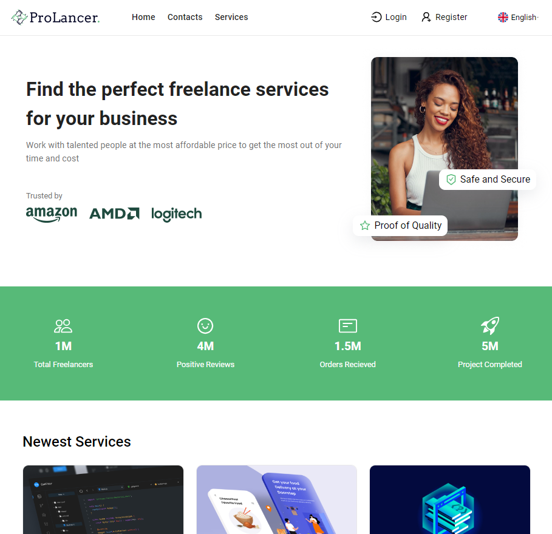

# Introduction

This project is a freelancer platform.

# Getting Started

In this section, you'll find information on how to get the project up and running on your local system.

## Installation process

To install the necessary dependencies, run the following command:

- Clone the repository to your local:

```bash
git clone https://github.com/EdgaSk/prolancer.git
```

#### Front-End

- Install Node with package:
  yarn add
- Run project:
  yarn dev

#### Back-End

- Install Node with package:
  npm install
- Run project:
  npm run dev or npm run start

### Software dependencies

This project uses the following software dependencies:

Front-end

```bash
@emotion/react: 11.11.1
@emotion/styled: 11.11.0
@mui/icons-material: 5.14.13
@mui/material: 5.14.13
axios: 1.5.1
formik: 2.4.5
i18next: 23.5.1
prop-types: 15.8.1
react: 18.2.0
react-dom: 18.2.0
react-i18next: 13.2.2
react-icons: 4.11.0
react-router-dom: 6.16.0
sass: 1.69.2
yup: 1.3.2
```

Back-end

```bash
bcrypt: 5.1.1
cookie-parser: 1.4.6
cors: 2.8.5
date-fns: 2.30.0
dotenv: 16.3.1
express: 4.18.2
jsonwebtoken: 9.0.2
mongodb: 6.1.0
multer: 1.4.5-lts.1
nodemon: 3.0.1
uuid: 9.0.1
```

# API References

In this section, you'll find information about the available API routes and their purposes.

## General

- **GET /:** This route is for checking if the server API is running. It responds with a message indicating that the server is operational.

## User Authentication

- **POST /register:** Register a new user. Requires providing user details such as name, email, and password. Returns a token upon successful registration.

- **POST /login:** Log in with an existing user account. Requires providing email and password. Returns a token upon successful login.

- **POST /refresh:** Refresh the access token. Requires a valid refresh token. Returns a new access token upon successful refresh.

- **POST /logout:** Log out the current user. Requires a valid access token. Invalidates the current access token.

## Public Data

- **GET /userspublic:** Get public information about users. This route provides access to basic user profiles and details that are not sensitive.

- **GET /servicespublic:** Get public information about services offered. This route allows users to view available services without authentication.

## File Uploads

- **/uploads:** This route serves static files from the "uploads" directory, allowing access to uploaded files (e.g., user avatars or service images).

## Protected Routes

The following routes require a valid access token. You must include an access token in the request header.

- **GET /users:** Get user-specific data, including personal details and account information.

- **POST /jobs:** Create a new job listing. This route is for freelancers to offer their services.

- **POST /services:** Create a new service listing. This route is for users to offer various services.

Remember to include the required tokens and follow authentication procedures for secure access to protected routes.

## Project Preview


